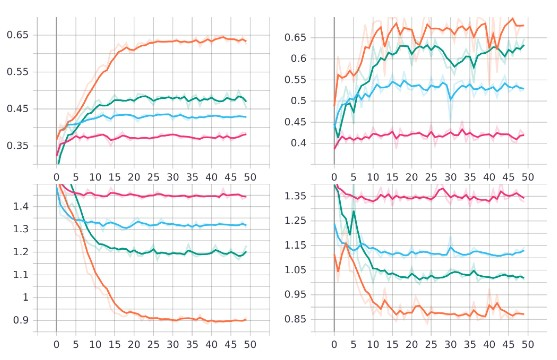

# Digital-Grading-of-Fruits

The following project is an attempt to identify the grading (freshness) of tomatoes using Deep Learning and classical machine learning approaches. 

# Media & Attachments 

For easier understanding, the following video has the start-to-finish explanation of the project: [Video Demonstration](https://drive.google.com/file/d/1FDHY3o1OUwBDnDq-Qs5ZnkGsRsTn7zqY/view?usp=sharing)

Project Report: [Report](https://drive.google.com/file/d/16tealUrEAfHp3zB2Nk5YZUih1hv_ReD9/view?usp=sharing)

## Methodology 

The following flowchart depicts the pipeline of the entire project. 

## Data Preparation 

- Before moving ahead with the project, it is recommended to run `bash run.sh` to extract the numerical values of various features and save them in a csv. 

- Later, run the `python combine_csv.py` to combine the individual csv files into one single file.

## Project Execution 

There are two seperate approaches that we have taken to solve the task. The first one involving using Image Processing algorithms to extract important features in the form of numerical data and then train a model using different machine learning approaches. The alternate approach we took was to use a CNN based model and has done exhaustive experiments with various hyperparameters in obtaining the optimal performance. 

- For Machine Learning approach, after preparing the data from the preparation section, run the `adaboost.ipynb` notebook. 
- For Deep Learning approach, you can directly run the `train.ipynb` notebook.

## Results

In the machine learning approach: 

<table><tbody>
<!-- START TABLE -->
<!-- TABLE HEADER -->
<th valign="bottom">Index</th>
<th valign="bottom">Algorithm</th>
<th valign="bottom">Validation Accuracy</th>
<!-- TABLE BODY -->

<tr><td align="center">1</td>
<td align="center">Random Forest</td>
<td align="center">99.41%</td>
</tr>

<tr><td align="center">2</td>
<td align="center">Linear SVM</td>
<td align="center">95.45%</td>
</tr>

<tr><td align="center">3</td>
<td align="center">AdaBoost</td>
<td align="center">79.65%</td>
</tr>

<!-- END OF TABLE BODY -->
</tbody></table>

In the Deep Learning approach: 

<table><tbody>
<!-- START TABLE -->
<!-- TABLE HEADER -->
<th valign="bottom">Index</th>
<th valign="bottom">Model</th>
<th valign="bottom">Validation Accuracy</th>
<!-- TABLE BODY -->

<tr><td align="center">1</td>
<td align="center">ResNet18</td>
<td align="center">66.70%</td>
</tr>

<tr><td align="center">2</td>
<td align="center">ResNet34</td>
<td align="center">70.00%</td>
</tr>

<tr><td align="center">3</td>
<td align="center">ResNet50</td>
<td align="center">64.70%</td>
</tr>

<tr><td align="center">1</td>
<td align="center">ResNet101</td>
<td align="center">64.50%</td>
</tr>

<tr><td align="center">2</td>
<td align="center">ResNet152</td>
<td align="center">63.8%</td>
</tr>

<tr><td align="center">3</td>
<td align="center">WideResNet50</td>
<td align="center">61.30%</td>
</tr>

The following graph follows the order of Training Accuracy, Validation Accuracy, Validation Loss, Training Loss (clockwise)

<!-- END OF TABLE BODY -->
</tbody></table>

We have also experimented our best performing ResNet34 model with various optimisers, and the results are as follows:

<table><tbody>
<!-- START TABLE -->
<!-- TABLE HEADER -->
<th valign="bottom">Index</th>
<th valign="bottom">Optimiser</th>
<th valign="bottom">Validation Accuracy</th>
<!-- TABLE BODY -->

<tr><td align="center">1</td>
<td align="center">SGD</td>
<td align="center">70.00%</td>
</tr>

<tr><td align="center">2</td>
<td align="center">ResNet34</td>
<td align="center">64.00%</td>
</tr>

<tr><td align="center">3</td>
<td align="center">ResNet50</td>
<td align="center">53.00%</td>
</tr>

<tr><td align="center">1</td>
<td align="center">ResNet101</td>
<td align="center">42.00%</td>
</tr>

<!-- END OF TABLE BODY -->
</tbody></table>

The following graph follows the order of Training Accuracy, Validation Accuracy, Validation Loss, Training Loss (clockwise)

